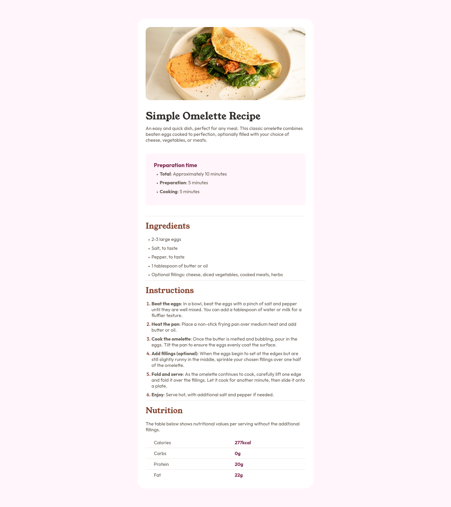
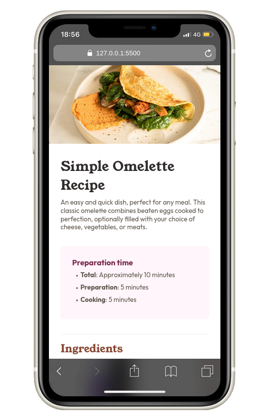

# Frontend Mentor - Recipe page solution

This is a solution to the [Recipe page challenge on Frontend Mentor](https://www.frontendmentor.io/challenges/recipe-page-KiTsR8QQKm). Frontend Mentor challenges help you improve your coding skills by building realistic projects.

## Table of contents

- [Overview](#overview)
  - [Screenshot](#screenshot)
  - [Links](#links)
- [My process](#my-process)
  - [Build with](#built-with)
  - [What I learned](#what-i-learned)
  - [Useful resources](#useful-resources)
- [Author](#author)

## Overview

### Screenshot




### Links

- Solution URL: [](https://github.com/)
- Live Site URL: [](htpps://github.com/)

## My process

### Build with

- Semantic HTML5 markup
- CSS custom properties
- Mobile-first workflow

### What I learned

During this project, I learned some valuable lessons about HTML and CSS, especially in the use of semantic elements and better styling techniques. Here are some of the things I learned:

1. Use CSS for Borders, Not `<hr>`. Instead of using the `<hr>` tag to create a border between sections, I learned that it is better to use CSS. In HTML5, the `<hr>` element is not just a decorative line, but has semantic meaning. Its function is to indicate a change in topic within a section of text. Common mistakes:
   Using `<hr>` only for visual purposes (e.g. as a section divider), without considering its semantic meaning. The correct way:
   If you want to indicate a transition between sections within an article or section, use `<hr>` inside `<section>`.
   If you just want a decorative border, use **CSS** with border, margin, or padding instead of `<hr>`.

2. Using `<time>` with the `datetime=""` Attribute. I learned that the <time> element can be used to denote time, making it more semantic and useful for search engines.

3. Creating and Using CSS Variables for Colors. I learned how to create custom CSS variables for colors, so they can be reused across different parts of a project more efficiently. For example:

```css
:root {
  --primary-color: #ff7b54;
}

.button {
  background-color: var(--primary-color);
}
```

4. Using Internal Fonts with `@font-face` I learned how to use local fonts in my projects with `@font-face`, so I don't always have to rely on Google Fonts or external web fonts.

```css
@font-face {
  font-family: 'MyCustomFont';
  src: url('/fonts/mycustomfont.woff2') format('woff2');
}

body {
  font-family: 'MyCustomFont', sans-serif;
}
```

5. Using ::marker to Customize Lists I learned how to use the `::marker` pseudo-element to change the appearance of list elements like `<ul>` and `<ol>`.

```css
ul li::marker {
  color: red;
  font-size: 1.2rem;
}
```

With this, I can give a more unique style to the list without changing the HTML structure.

### Useful resources

## Author

- Frontend Mentor - [@lutfiismail52](https://www.frontendmentor.io/profile/lutfiismail52)
- YouTube - [@kodedusk](https://www.youtube.com/@kodedusk)
- Instagram - [@lutfiismail47](https://www.instagram.com/lutfiismail47)
- Medium - [@lutfiismail47](https://medium.com/@lutfiismail47)
